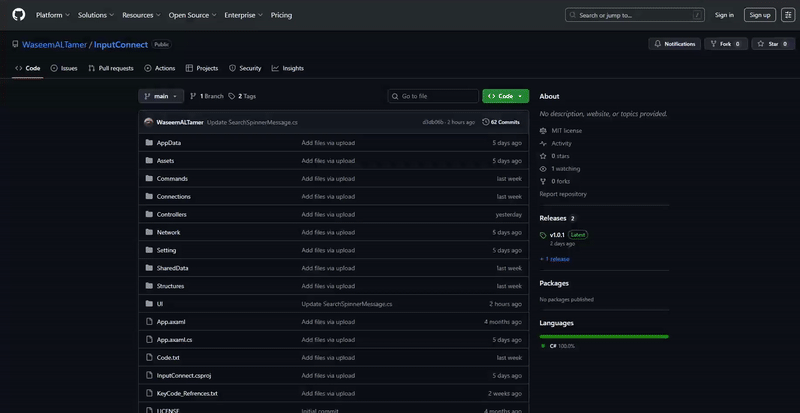
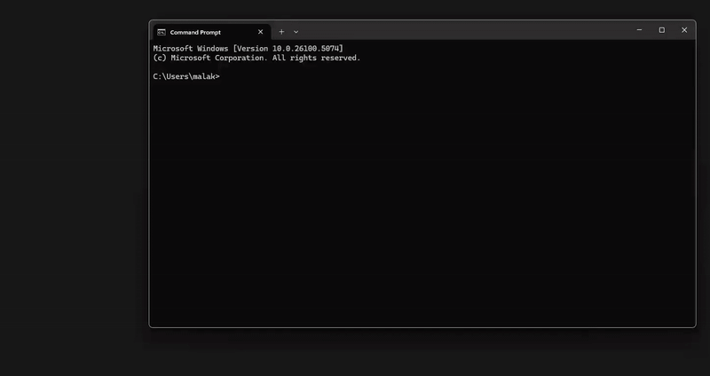
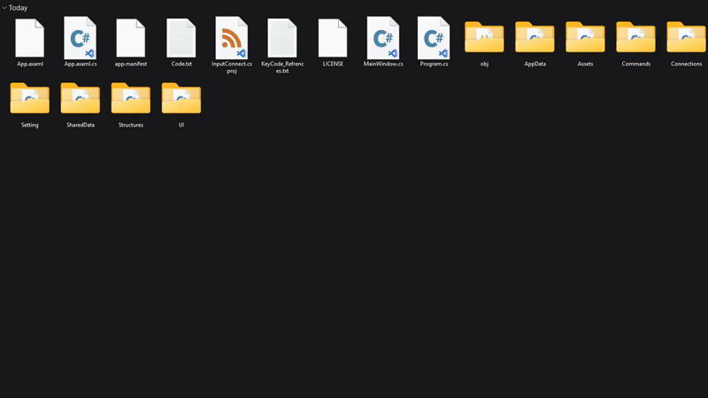
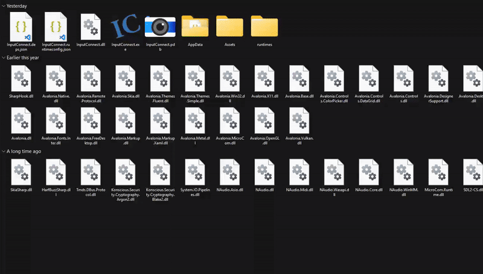
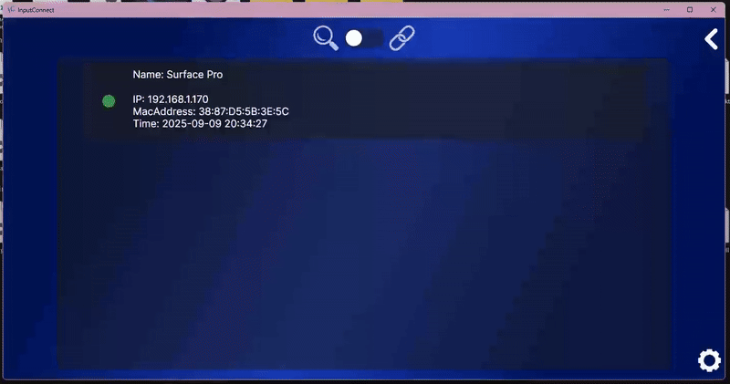
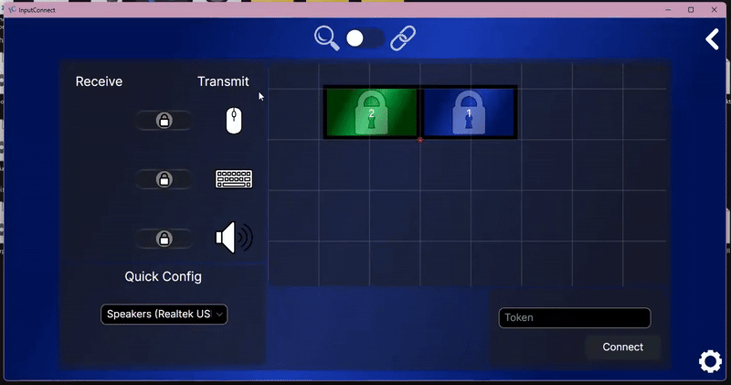
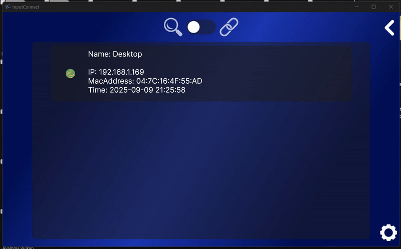
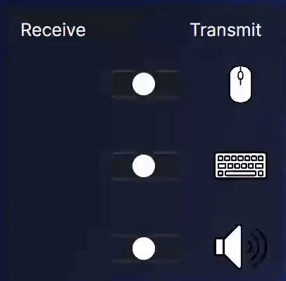

## </img> InputConnect

Take full control of your digital workspace. InputConnect transforms any device into a natural extension of your main computer—seamlessly sharing your mouse, keyboard, clipboard, and audio across multiple devices.

With InputConnect, a second device feels just like adding another monitor:
- Stream audio across devices
- Use the same keyboard on multiple devices
- Control multiple devices with one mouse
- Copy and paste text effortlessly between devices


All of this works smoothly and naturally, allowing you to research, write documents, or play games as if you were using a second monitor.

It also helps reduce the load on your main device by seamlessly sharing tasks with another.


## 📥 Installation

1. Download the latest release from [Releases](https://github.com/WaseemALTamer/InputConnect/releases) that matches your system.

      

2. Extract -> Run (InputConnect)

      


## 📄 Build from Source

### Requirements
You will need ".NET 8 SDK" and optionally Git.

- .NET 8 SDK [Download](https://dotnet.microsoft.com/en-us/download/dotnet/8.0)
- Git [Download](https://git-scm.com/downloads)

### Option 1: Clone with Git (recommended)
If you have Git installed, open **Command Prompt** and run the following commands one by one:
```bash
git clone https://github.com/WaseemALTamer/InputConnect
cd InputConnect
dotnet build
dotnet run
```
 

### Option 2: Manual Download
Download the [Source code](https://github.com/WaseemALTamer/InputConnect), then open **PowerShell** in the extracted folder and run the following commands one by one:  
```bash
dotnet build
dotnet run
```
 


## ✨ Features

- **Device Discovery** - devices on the same network can discover each other


- **Secure Connections** – All data transferred over secure connections with ASE-256 Encryption.


-  **Keyboard & Mouse Sharing** – Move between devices as if it was a second mointor and use your keybaord.


- **Audio Sharing** – Stream audio from one device to another with minimal latency all over UDP while being encrypted.


- **Clipboard Sync** – Instantly copy and paste text between devices.  


- **Saves connections** - saves connections and loads them on startup so you can carry on with the setup that you left with.


- **Works Over Different Network** - you can change your ip address and still be able to connect to the same device without editing your connection.


- **Cross-Platform Support** – Works on Windows and Linux (macOS planned, missing Features).  


- **Runs in the background** - will run in the background if Connections are available 


- **Smooth Animations** – Custem Animation (Reusable scripts).


- **Runs on old hardware** – low system requirements.


## 👩‍💻 How to use

### 🔗 How to connect
1. Open **InputConnect** on all the devices you want to link together.

    

2. On your main device, look at the list of available devices and select the one you want to connect to.

    

3. In the **Token box**, enter a token (any word or phrase you choose), then click **Connect**.

    

4. On the other device, a popup will appear. Enter the same token you used in step 3, then click **Accept**. Repeat steps 2–4 for each additional device you want to connect.

    

5. On the device you want to share a specific input from, set its mode to **Transmit**. On the other devices that will use that input, set the mode to **Receive**.

    </img></img>


### 💡 Tips
- On the device set to transmit the mouse, you can rearrange the screen positions so the cursor moves naturally between devices, matching the way your monitors are physically arranged.

- To remove a connection, go to the **Links** tab, click the **trash/bin** icon, then confirm deletion.

- Once a connection is established, you can click the “**X**” button — the app will minimise to the system tray and continue running in the background.

## 📜 License

This project is licensed under the [MIT License](LICENSE).  